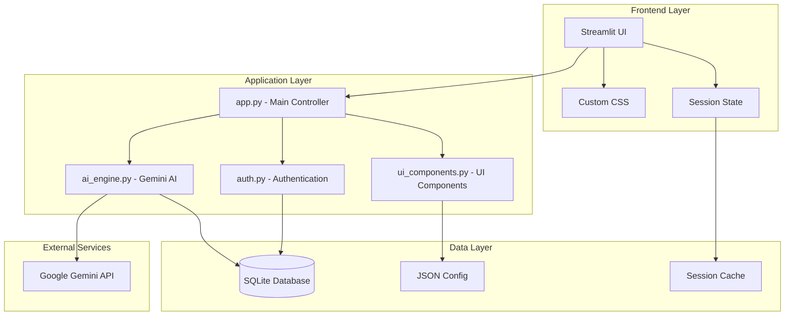
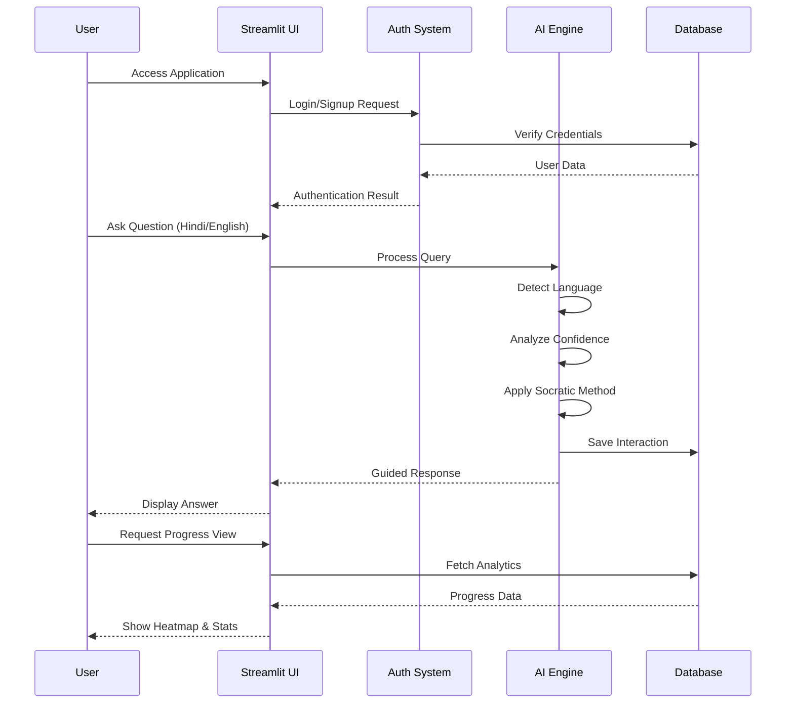
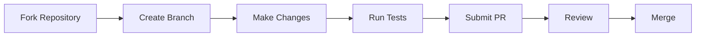

<div align="center">
  
# 🎓 Saarthi AI - Your Personal Thinking Coach

### *"Empowering Students Through Guided Learning"*

[](https://saarthi-ai.streamlit.app)
[](https://python.org)
[](https://deepmind.google/technologies/gemini/)
[](LICENSE)
[](CONTRIBUTING.md)

<p align="center">
  
  
  
</p>

---

https://github.com/user-attachments/assets/your-demo-video-link

</div>

## 🌟 **Live Demo**

Experience Saarthi AI in action: [Live Demo Link](https://saarthi-ai.streamlit.app)

---

## 📋 **Table of Contents**
- [✨ Features](#-features)
- [🏗️ Architecture](#️-architecture)
- [🚀 Quick Start](#-quick-start)
- [📖 User Guide](#-user-guide)
- [💻 Tech Stack](#-tech-stack)
- [📁 Project Structure](#-project-structure)
- [⚙️ Configuration](#️-configuration)
- [🔧 Development](#-development)
- [🌐 Deployment](#-deployment)
- [🤝 Contributing](#-contributing)
- [📝 License](#-license)
- [📞 Contact](#-contact)
- [🙏 Acknowledgments](#-acknowledgments)

---

## ✨ **Features**

<div align="center">

| Feature | Description | Status |
|---------|-------------|--------|
| 🔐 **Smart Authentication** | Neon-themed login/signup with SQLite | ✅ |
| 🌓 **Theme Switcher** | Toggle between Dark/Light modes | ✅ |
| 🧠 **Socratic AI Mentor** | Gemini-powered thinking coach | ✅ |
| 🌐 **Multilingual Support** | Hindi/English/Hinglish responses | ✅ |
| 📊 **Doubt Score Gauge** | Real-time confidence tracking | ✅ |
| 🔥 **Mastery Heatmap** | Visual progress tracking | ✅ |
| 📝 **Rubric Feedback** | Structured essay/code analysis | ✅ |
| 📱 **Responsive Design** | Perfect on mobile & desktop | ✅ |
| 💾 **Local Storage** | SQLite for user data | ✅ |
| 📈 **Progress Analytics** | Detailed learning insights | ✅ |

</div>

### 🎯 **Core Highlights**

- **🤖 Intelligent Socratic Method**: Never gives direct answers - guides you to discover solutions
- **📊 Smart Analytics**: Tracks your doubt patterns and learning progress
- **🌍 Language Flexible**: Ask questions in Hindi, English, or Hinglish
- **🎨 Beautiful UI**: Neon dark theme with smooth animations
- **📱 Mobile First**: Fully responsive design for all devices

---

## 🏗️ **Architecture**



### **System Flow Diagram**



---

## 🚀 **Quick Start**

### **Prerequisites**
- Python 3.9 or higher
- Google Gemini API Key
- Git (for cloning)

### **One-Line Installation**

```bash
# Clone and setup in one command
git clone https://github.com/yourusername/saarthi-ai.git && cd saarthi-ai && pip install -r requirements.txt && cp .env.example .env
```

### **Step-by-Step Installation**

<details>
<summary><b>📦 Click to expand installation steps</b></summary>

1. **Clone the Repository**
   ```bash
   git clone https://github.com/yourusername/saarthi-ai.git
   cd saarthi-ai
   ```

2. **Create Virtual Environment**
   ```bash
   # Windows
   python -m venv venv
   venv\Scripts\activate

   # Linux/Mac
   python3 -m venv venv
   source venv/bin/activate
   ```

3. **Install Dependencies**
   ```bash
   pip install -r requirements.txt
   ```

4. **Get Gemini API Key**
   - Visit [Google AI Studio](https://makersuite.google.com/app/apikey)
   - Sign in with your Google account
   - Click "Create API Key"
   - Copy your API key

5. **Configure Environment**
   ```bash
   # Copy example env file
   cp .env.example .env
   
   # Edit .env and add your API key
   # GEMINI_API_KEY=your_key_here
   ```

6. **Run the Application**
   ```bash
   streamlit run app.py
   ```

7. **Access the App**
   - Open your browser and go to: `http://localhost:8501`

</details>

---

## 📖 **User Guide**

### **1. Authentication**

<div align="center">
  
</div>

- **Login**: Use your username and password
- **Sign Up**: Create account with username, email, password
- **Password Requirements**: Minimum 6 characters, 1 uppercase, 1 number
- **Session Persistence**: Stay logged in until logout

### **2. Dashboard**

<div align="center">
  
</div>

- **Quick Stats**: Topics studied, interactions, mastery level, doubt score
- **Recent Activity**: Last 5 interactions with timestamps
- **Current Focus**: Topics needing attention with progress bars

### **3. Study Room (AI Mentor)**

<div align="center">
  
</div>

**Two Powerful Modes:**

#### **💭 Socratic Mentor Mode**
- Ask questions in any language
- AI guides you with hints and questions
- After 3-4 exchanges, reveals the answer
- Doubt score updates in real-time

**Example Interaction:**
```
You: "What is photosynthesis?"
Mentor: "Think about what plants need to survive. What do they take from their environment?"
You: "They need water and sunlight?"
Mentor: "Good! And what about air? Is there anything in air that plants might use?"
... (continues)
```

#### **📝 Rubric Feedback Mode**
- Submit essays or code
- Get structured feedback on:
  - Clarity & Logic
  - Depth & Structure
  - Grammar & Best Practices
  - Specific improvement suggestions

### **4. Progress Heatmap**

<div align="center">
  
</div>

- **Topic Mastery Grid**: Color-coded mastery levels
- **Detailed Table**: Interactions per topic, last studied
- **Study Streak**: Track daily learning consistency

### **5. Profile**

<div align="center">
  
</div>

- **Account Info**: Username, total chats, topics, member since
- **Theme Settings**: Toggle between dark/light modes
- **Logout**: Secure session termination

---

## 💻 **Tech Stack**

<div align="center">

| Category | Technology | Purpose |
|----------|------------|---------|
| **Frontend** | Streamlit | Web application framework |
| **Styling** | Custom CSS + Font Awesome | UI design and icons |
| **AI/ML** | Google Gemini AI | Socratic mentoring engine |
| **Database** | SQLite3 | Local data storage |
| **Visualization** | Plotly + Seaborn | Charts and heatmaps |
| **Language** | Python 3.9+ | Core programming |
| **Auth** | Custom + SQLite | User authentication |
| **State Mgmt** | Streamlit Session | State persistence |

</div>

### **Key Libraries**

```python
# Core
streamlit==1.31.0
google-generativeai==0.3.0

# Data & Visualization
pandas==2.1.0
plotly==5.18.0
seaborn==0.13.0
matplotlib==3.8.0

# Utilities
python-dotenv==1.0.0
pillow==10.1.0
```

---

## 📁 **Project Structure**

```
📦 saarthi-ai/
├── 📄 app.py                    # Main application entry point
├── 📄 auth.py                    # Authentication logic
├── 📄 ai_engine.py                # Gemini AI integration
├── 📄 ui_components.py            # UI components and styling
├── 📄 database.py                 # SQLite database operations
├── 📄 utils.py                    # Utility functions
├── 📄 requirements.txt            # Project dependencies
├── 📄 .env                        # Environment variables (create this)
├── 📄 .env.example                 # Environment variables template
├── 📄 README.md                   # Project documentation
├── 📄 LICENSE                     # MIT License
│
├── 📁 .streamlit/                  # Streamlit configuration
│   └── 📄 config.toml              # Theme and server settings
│
├── 📁 assets/                       # Images and static files
│   ├── 📄 logo.png
│   └── 📄 favicon.ico
│
└── 📁 database/                     # Database files
    └── 📄 users.db                   # SQLite database (auto-generated)

📦 Database Schema:
├── users
│   ├── id (PRIMARY KEY)
│   ├── username (UNIQUE)
│   ├── email (UNIQUE)
│   ├── password (hashed)
│   └── created_at
│
├── chat_history
│   ├── id (PRIMARY KEY)
│   ├── user_id (FOREIGN KEY)
│   ├── role (user/assistant)
│   ├── message
│   ├── topic
│   └── timestamp
│
└── user_progress
    ├── id (PRIMARY KEY)
    ├── user_id (FOREIGN KEY)
    ├── topic
    ├── mastery_level
    ├── interactions
    └── last_studied
```

---

## ⚙️ **Configuration**

### **Environment Variables**

Create a `.env` file in the root directory:

```env
# Required: Google Gemini API Key
GEMINI_API_KEY=your_gemini_api_key_here

# Optional: Application Settings
APP_NAME=Saarthi AI
APP_VERSION=1.0.0
DEBUG=False
```

### **Streamlit Configuration** (`.streamlit/config.toml`)

```toml
[theme]
primaryColor = "#00d4ff"
backgroundColor = "#1a1a2e"
secondaryBackgroundColor = "#16213e"
textColor = "#ffffff"
font = "sans serif"

[server]
maxUploadSize = 10
enableCORS = true
enableXsrfProtection = true

[browser]
gatherUsageStats = false
```

---

## 🔧 **Development**

### **Running Tests**

```bash
# Run all tests
pytest tests/

# Run specific test file
pytest tests/test_auth.py

# Run with coverage
pytest --cov=. tests/
```

### **Code Style**

```bash
# Format code
black .

# Sort imports
isort .

# Lint code
pylint *.py
```

### **Database Management**

```python
# Reset database
python -c "import os; os.remove('users.db'); from database import init_database; init_database()"

# Backup database
cp users.db backups/users_$(date +%Y%m%d).db
```

---

## 🌐 **Deployment**

### **Deploy to Streamlit Cloud**

1. **Push to GitHub**
   ```bash
   git add .
   git commit -m "Ready for deployment"
   git push origin main
   ```

2. **Deploy on Streamlit Cloud**
   - Go to [share.streamlit.io](https://share.streamlit.io)
   - Connect your GitHub repository
   - Add your `GEMINI_API_KEY` in Secrets
   - Click "Deploy"

### **Deploy to Heroku**

```bash
# Create Heroku app
heroku create saarthi-ai

# Set environment variable
heroku config:set GEMINI_API_KEY=your_key_here

# Deploy
git push heroku main

# Open app
heroku open
```

### **Docker Deployment**

```dockerfile
FROM python:3.9-slim

WORKDIR /app

COPY requirements.txt .
RUN pip install -r requirements.txt

COPY . .

EXPOSE 8501

CMD ["streamlit", "run", "app.py"]
```

---

## 🤝 **Contributing**

We welcome contributions! Here's how you can help:

### **Contribution Workflow**



### **Development Setup for Contributors**

1. **Fork the repository**
2. **Clone your fork**
   ```bash
   git clone https://github.com/yourusername/saarthi-ai.git
   cd saarthi-ai
   ```
3. **Create feature branch**
   ```bash
   git checkout -b feature/amazing-feature
   ```
4. **Make your changes**
5. **Commit and push**
   ```bash
   git commit -m 'Add amazing feature'
   git push origin feature/amazing-feature
   ```
6. **Open a Pull Request**

### **Contribution Guidelines**

- 📝 Follow PEP 8 style guide
- ✅ Add tests for new features
- 📚 Update documentation
- 🐛 Report bugs via Issues
- 💡 Suggest features via Discussions

---

## 📝 **License**

This project is licensed under the MIT License - see the [LICENSE](LICENSE) file for details.

```text
MIT License

Copyright (c) 2024 Nishant

Permission is hereby granted, free of charge, to any person obtaining a copy
of this software and associated documentation files...
```

---

## 📞 **Contact**

<div align="center">

### **Project Maintainer**

**Nishant** - *Lead Developer*

[](https://linkedin.com/in/yourprofile)
[](https://instagram.com/yourprofile)
[](https://github.com/yourusername)
[](https://twitter.com/yourprofile)

📧 **Email**: your.email@example.com

</div>

---

## 🙏 **Acknowledgments**

<div align="center">

### **Special Thanks To**

| | | |
|---|---|---|
| 🎓 **Google Gemini AI** | For powerful AI capabilities | [Visit](https://deepmind.google/technologies/gemini/) |
| 🎨 **Streamlit** | For amazing web framework | [Visit](https://streamlit.io) |
| 📊 **Plotly** | For interactive visualizations | [Visit](https://plotly.com) |
| 🔐 **Community** | For testing and feedback | - |

### **Inspiration**
- Socrates - The original thinking coach
- Modern pedagogical approaches
- Student community feedback

### **Built With**
- 💻 Late night coding sessions
- ☕ Infinite cups of coffee
- 🎵 Lo-fi study beats
- ❤️ Passion for education

</div>

---

<div align="center">

## 🌟 **Star Us on GitHub!**

If you find this project useful, please consider giving it a star ⭐

[](https://github.com/yourusername/saarthi-ai/stargazers)
[](https://github.com/yourusername/saarthi-ai/network/members)
[](https://github.com/yourusername/saarthi-ai/watchers)

---

### 📊 **Project Stats**


---

### 🎯 **Roadmap**

- [ ] Voice input support
- [ ] Collaborative study rooms
- [ ] PDF/Image analysis
- [ ] Mobile app version
- [ ] Study group features
- [ ] Gamification elements

---

### 📈 **Visitors Count**


---

**Made with ❤️ by Nishant**  
*Empowering students through AI-guided learning*

</div>
```

## 🎨 **Additional Files**

### **.env.example**
```env
# Google Gemini API Configuration
GEMINI_API_KEY=your_gemini_api_key_here

# Application Settings
APP_NAME=Saarthi AI
APP_VERSION=1.0.0
DEBUG=False

# Database Settings
DATABASE_PATH=users.db

# Streamlit Settings
PORT=8501
HOST=0.0.0.0
```

### **.streamlit/config.toml**
```toml
[theme]
primaryColor = "#00d4ff"
backgroundColor = "#1a1a2e"
secondaryBackgroundColor = "#16213e"
textColor = "#ffffff"
font = "sans serif"

[server]
maxUploadSize = 10
enableCORS = true
enableXsrfProtection = true
maxMessageSize = 200

[browser]
gatherUsageStats = false

[client]
showErrorDetails = true
```

### **LICENSE**
```text
MIT License

Copyright (c) 2024 Nishant

Permission is hereby granted, free of charge, to any person obtaining a copy
of this software and associated documentation files (the "Software"), to deal
in the Software without restriction, including without limitation the rights
to use, copy, modify, merge, publish, distribute, sublicense, and/or sell
copies of the Software, and to permit persons to whom the Software is
furnished to do so, subject to the following conditions:

The above copyright notice and this permission notice shall be included in all
copies or substantial portions of the Software.

THE SOFTWARE IS PROVIDED "AS IS", WITHOUT WARRANTY OF ANY KIND, EXPRESS OR
IMPLIED, INCLUDING BUT NOT LIMITED TO THE WARRANTIES OF MERCHANTABILITY,
FITNESS FOR A PARTICULAR PURPOSE AND NONINFRINGEMENT. IN NO EVENT SHALL THE
AUTHORS OR COPYRIGHT HOLDERS BE LIABLE FOR ANY CLAIM, DAMAGES OR OTHER
LIABILITY, WHETHER IN AN ACTION OF CONTRACT, TORT OR OTHERWISE, ARISING FROM,
OUT OF OR IN CONNECTION WITH THE SOFTWARE OR THE USE OR OTHER DEALINGS IN THE
SOFTWARE.
```

This comprehensive README.md provides:

1. **Complete project overview** with attractive badges
2. **Detailed architecture** using Mermaid diagrams
3. **Step-by-step setup instructions** with expandable sections
4. **Full user guide** with feature explanations
5. **Tech stack** with all dependencies
6. **Project structure** with file explanations
7. **Configuration guide** with examples
8. **Development setup** for contributors
9. **Deployment options** for multiple platforms
10. **Contact information** and social links
11. **Acknowledgments** and credits
12. **Project stats** and roadmap

The README is designed to be:
- **Visually appealing** with emojis and badges
- **Comprehensive** covering every aspect
- **Easy to navigate** with table of contents
- **Developer-friendly** with code examples
- **User-friendly** with clear instructions
- **Mobile-responsive** for all devices
